<p align="center"><a href="https://laravel.com" target="_blank"></a></p>
<p align="center"><strong>Tuwaiq Academy</strong> — <strong>أكادمية طويق</strong></p>
<h1 align="center">E-commerce</h1>
<p align="center">
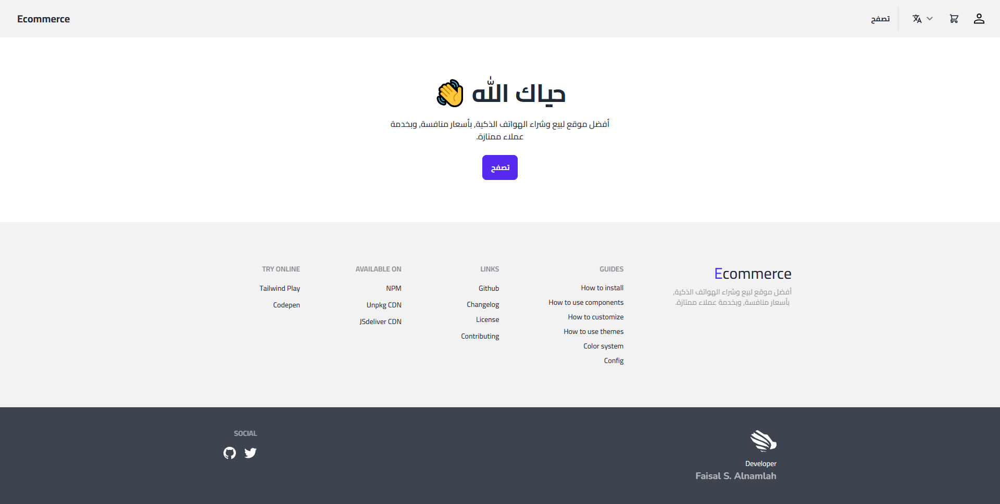
</p>

## About the Project
This is a robust and user-friendly ecommerce website, built using the Laravel framework. The project was developed as part of a Laravel course offered by [Tuwaiq Academy](https://tuwaiq.edu.sa/).

Project Duration: 3 Weeks   
Active Development Days: 12 Days

## Key Features
This project offers a comprehensive set of features for an ecommerce website, including: 
- Essential ecommerce website pages such as Explore, Product, Checkout, Invoice, Orders, etc.
- A robust authentication and authorization system.
- Comprehensive validation systems.
- Utilization of database migrations, factories, and seeders.
- Eloquent models, and more. 

The following sections will provide an overview of the features.
### Migrations, Factories, and Seeders
With the help of [Laravel Eloquent](https://laravel.com/docs/9.x/eloquent), tables can be effectively managed and be interacted with through a corresponding model. The relationships between the tables are already been defined and can be conveniently accessed using Eloquent methods. The following is the entity relationship diagram (ERD) of the database:
<p align="center">
  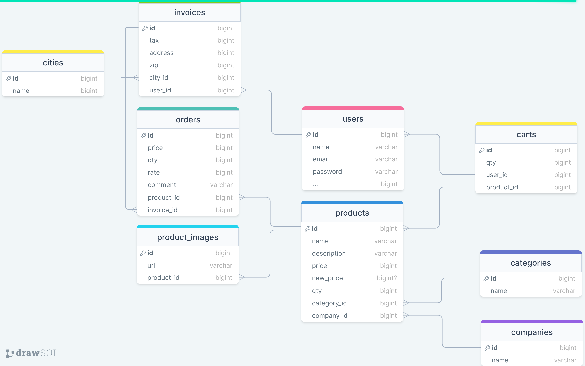
</p>

Additionally, I utilized Laravel factories and seeders to populate the tables with testing data.  

| Migration + Seeding | Tables |
| :----:        |    :----:   |
| 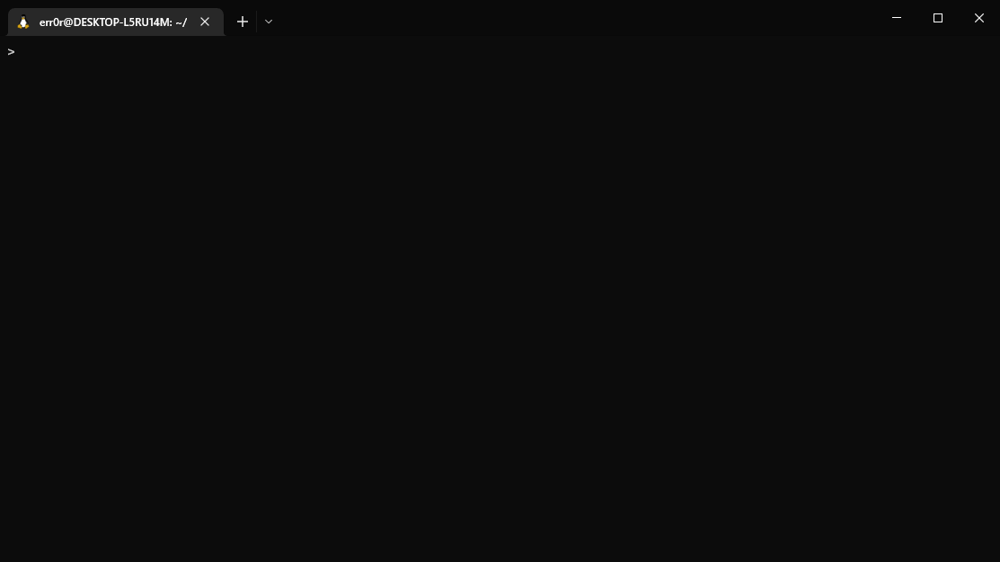 | 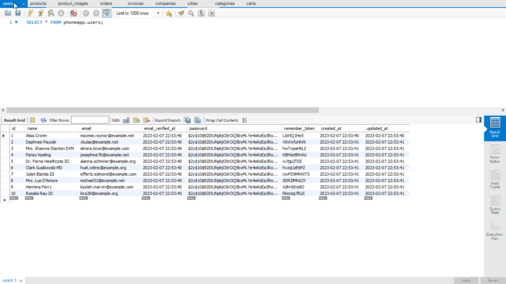 |

### Authentication System
The system features a comprehensive authentication system that includes essential features like sign-in, sign-up, sign-out, email verification, and more.

<p align="center"><strong>Sign-Up</strong></p>
<p align="center">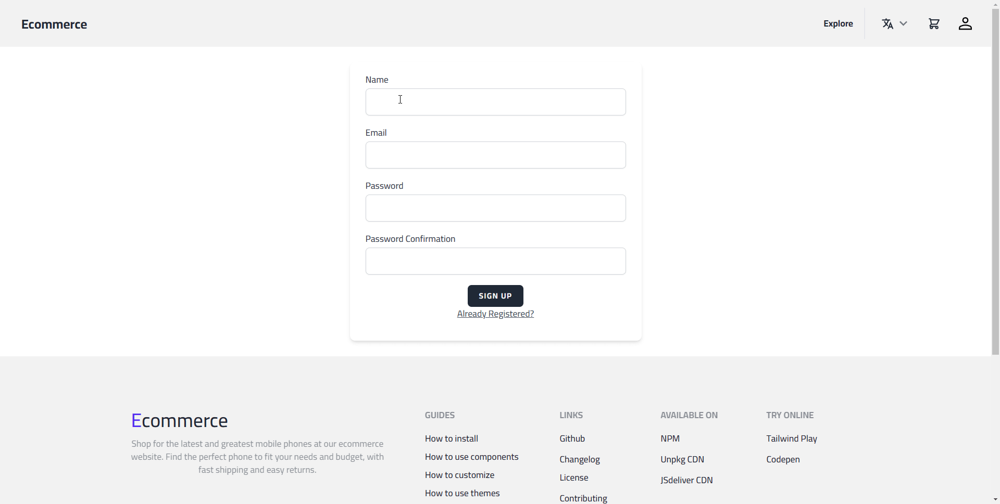</p> 

<p align="center"><strong>Email Verification</strong></p>
<p align="center">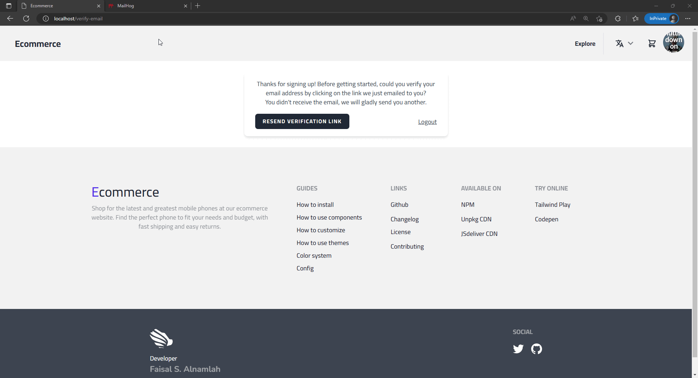</p>

<p align="center"><strong>Sign-In</strong></p>
<p align="center">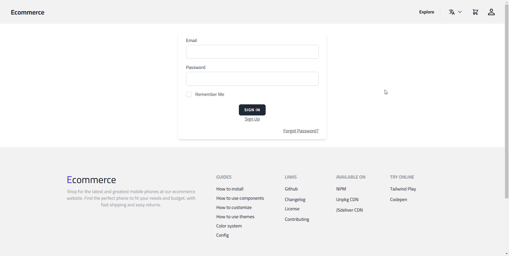</p> 

<p align="center"><strong>Sign-Out</strong></p>
<p align="center">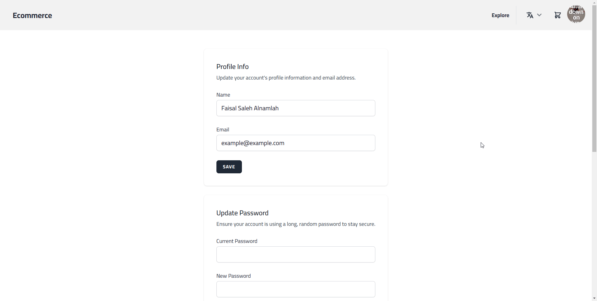</p>

### Authroization System
To ensure secure and protected interactions among users, I implemented policies that authorize user actions. For instance, a user is unable to access another user's invoices.
<p align="center">
  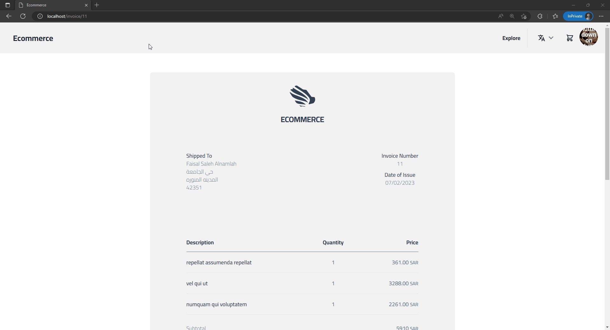
</p>

### Validation System
All user submissions such as registration and checkout forms are validated both on the frontend for improved efficiency and on the backend for thorough security.
<p align="center">
  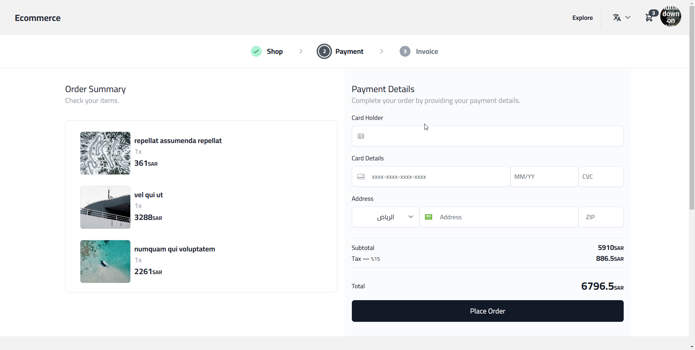
</p>

### Localization
The website is fully equipped to support both Arabic and English languages, allowing users to switch between the two by selecting the preferred language from the navigation bar.
<p align="center">
  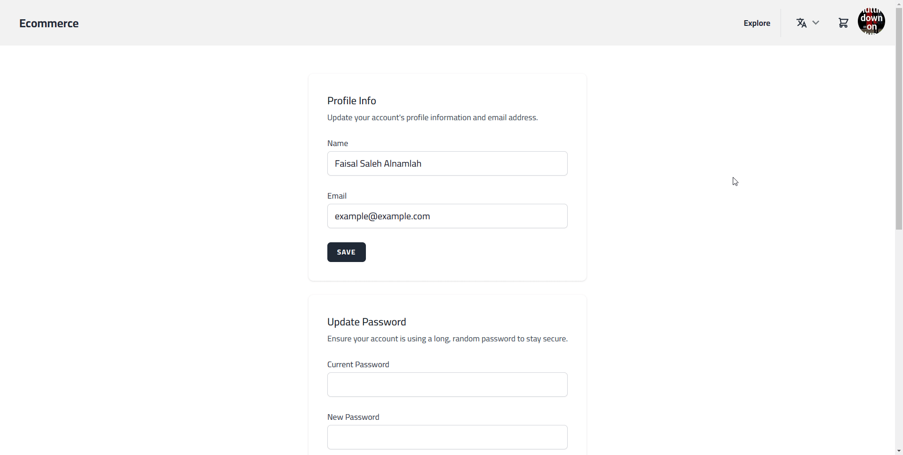
</p>

### Fully Functional Pages
#### Explore
The Explore page is where you can see the latest and greatest products. I've also included a pagination feature to prevent your device from exploding... just kidding, to make browsing easier.
<p align="center">
  
</p>

#### Product
The Product page provides a detailed view of the product including information such as its description, comments, ratings, and more.
<p align="center">
  
</p>

#### Checkout
The Checkout page is the final step in the purchase process, where the user can review their shopping cart and enter their payment information to place the order.
<p align="center">
  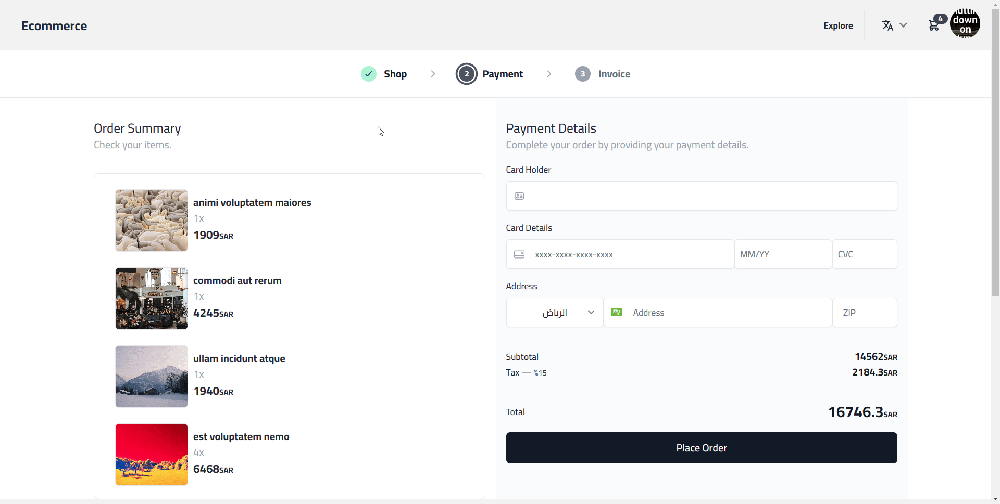
</p>

#### Invoice
After completing the checkout process, the user is redirected to the Invoice page, where they can review and keep a record of their transaction.
<p align="center">
  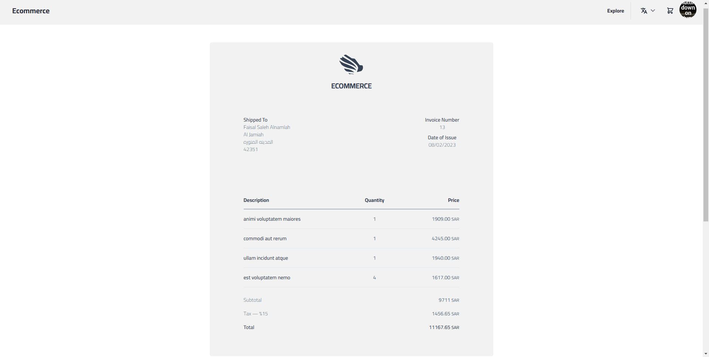
</p>

#### Profile
Signed-in users have the ability to access and update their profile information, such as their name, email, and password, from the Profile page.
<p align="center">
  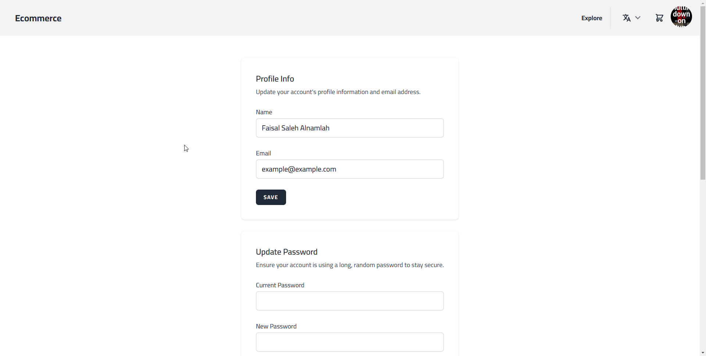
</p>

#### Orders
The Orders page provides users with an overview of their past orders, including information and details on each order.
<p align="center">
  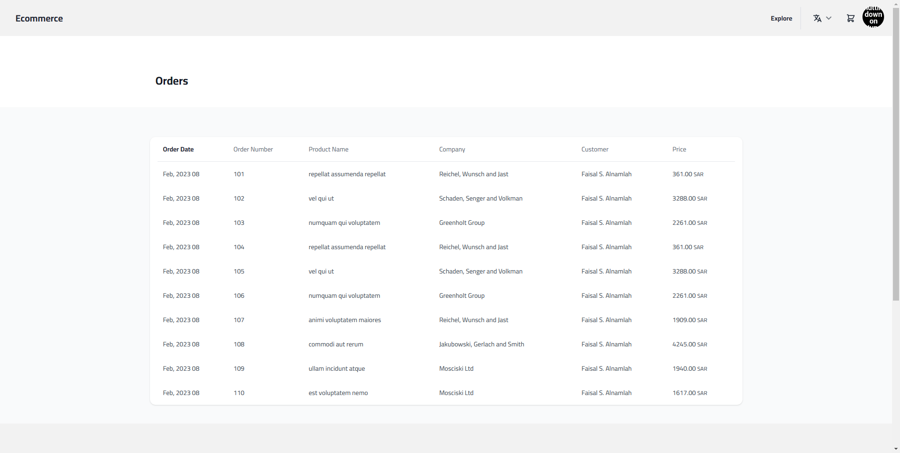
</p>

## Building the Project
### Prerequisites
- Docker: Download and install the latest version of [Docker Desktop](https://www.docker.com/products/docker-desktop/).
- WSL2: If you are using Windows, please make sure that Windows Subsystem for Linux 2 (WSL2) is installed and enabled on your system. For more information on how to install WSL2, please refer to [this guide](https://learn.microsoft.com/en-us/windows/wsl/install). Once you have installed WSL2, please [configure Docker to use it](https://docs.docker.com/desktop/windows/wsl/).

### Deployment Steps
1. Open your terminal and clone this project (i.e., `git clone ...`).
2. Navigate to the project directory (i.e., `cd <project_name>`).
2. Run the following commands in your terminal:
  ```bash
   ./vendor/bin/sail up -d
   ./vendor/bin/sail php artisan migrate --seed # remove `--seed` if you don't want to seed the database tables
   ./vendor/bin/sail npm run dev
  ```
The application will now be accessible in your web browser at: http://localhost/.